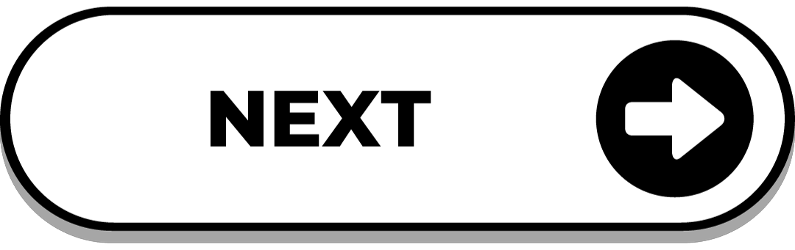

### About C Programming

- `C` is low level programming language. low level in computers generally means a programming language that provides more control over hardware. Thus similar things can be done in C

- `C` was developed by **Dennis Ritchie** in 1972 at Bell Labs.
- `C` is a procedural programming language *(POP)* & follows top-down ⬇ approach while executing a program.

#### Extra Info:
- `C++` is a object oriented programming language *(OOP)* & follows bottom-up ⬆ approach while executing a program.


---

### Basic Structure of C Program

```c
#include<stdio.h> // Preprocessor Statement

int main() // main() is a function
{
    // Statements
    return 0;
}
```

`#include<stdio.h>` is a preprocessor statement. In that `stdio.h` is a header file. Header files are predefined files that contains useful functions like `printf()` & `scanf()`.

---

### Hello World Program in `C`

```c
#include<stdio.h>

int main()
{
    printf("Hello World");
    return 0;
}
```
<br>

- `printf()` is a predefined function in `stdio.h` header file. It is used to print something on the screen.
  
---

<br>

<a href="Data_Types.md">

</a>


